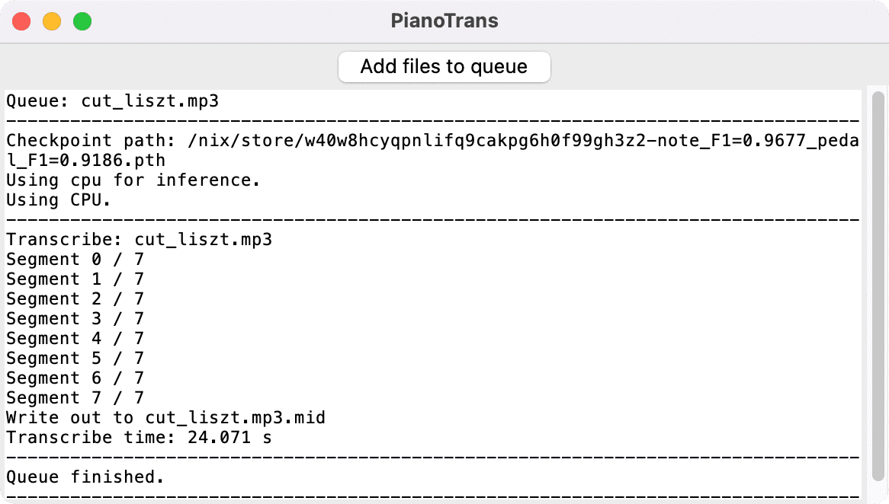
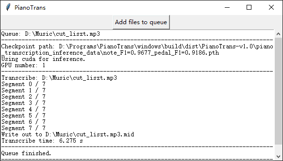

## Simple GUI for ByteDance's Piano Transcription with Pedals

[ByteDance's Piano Transcription][1] is the PyTorch implementation of the
piano transcription system, "High-resolution Piano Transcription with Pedals
by Regressing Onsets and Offsets Times `[1]`".

Using this, we can transcribe piano recordings into MIDI files with pedals.

This is a simple GUI and packaging for Windows and [Nix on Linux/macOS][2].

### Requirement

* OS: Windows 7 or later (64-bit), Linux, macOS (Intel/M1)
* Memory: at least 4G

Only Windows 10, Debian Linux 10, and macOS 12.1 M1 are tested.

### How to use on Windows

1. Download [Microsoft Visual C++ Redistributable for Visual Studio 2015, 2017 and 2019][3] `vc_redist_x64.exe` and install
2. Download and unpack [PianoTrans-v0.2.1.7z][4] (1.5GB download, unpack using [7zip][5])
3. Close other apps to free memory, need at least 2G free memory
4. Run `PianoTrans.exe` in `PianoTrans` directory
5. Choose audio/video files, multiple selection is supported
6. Result MIDI files are in the same directory as the audio files

If you want right click menu for audio files, run `RightClickMenuRegister.bat`,
then you can right click an audio file, and choose `Piano Transcribe`.

PianoTrans automatically uses GPU for inference, if you encounter any problem,
you can try `PianoTrans-CPU.bat` to force using CPU.

### How to use on Linux/macOS using Nix

This howto is for [Nix][2] on Linux/macOS, if you don't use Nix, you can also
follow the upstream [install and usage][6] guide for Python pip instead.

1. Open the terminal
2. Run `sh <(curl -L https://nixos.org/nix/install) --daemon` to install Nix,
   see https://nixos.org/download.html for more details
3. Run `nix --extra-experimental-features 'flakes nix-command' profile install github:azuwis/pianotrans`
   to install pianotrans
4. Run `pianotrans` to open the GUI, choose audio/video files

[1]: https://github.com/bytedance/piano_transcription
[2]: https://nixos.org
[3]: https://support.microsoft.com/en-us/help/2977003/the-latest-supported-visual-c-downloads
[4]: https://github.com/azuwis/PianoTrans/releases/download/v0.2.1/PianoTrans-v0.2.1.7z
[5]: https://www.7-zip.org/download.html
[6]: https://github.com/qiuqiangkong/piano_transcription_inference

### Changelog

#### [0.2.1] - 2021-12-23

* Update pytorch to 1.10.1.
* Update piano-transcription-inference to 0.0.5

#### [0.2] - 2021-09-27

* Update pytorch to 1.9.1.
* Add PianoTrans-CPU.bat to force using CPU for inference.

#### [0.1] - 2021-02-02

* Initial release.

## Cite
`[1]` Qiuqiang Kong, Bochen Li, Xuchen Song, Yuan Wan, and Yuxuan Wang. "High-resolution Piano Transcription with Pedals by Regressing Onsets and Offsets Times." arXiv preprint arXiv:2010.01815 (2020). [[pdf]](https://arxiv.org/pdf/2010.01815.pdf)
